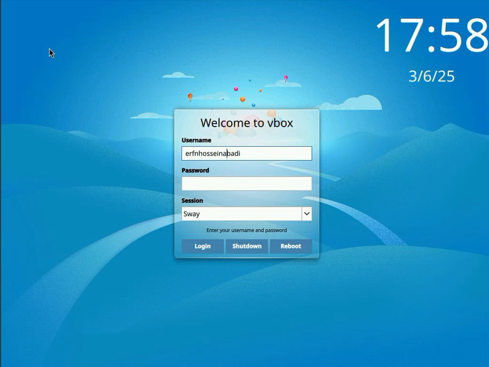
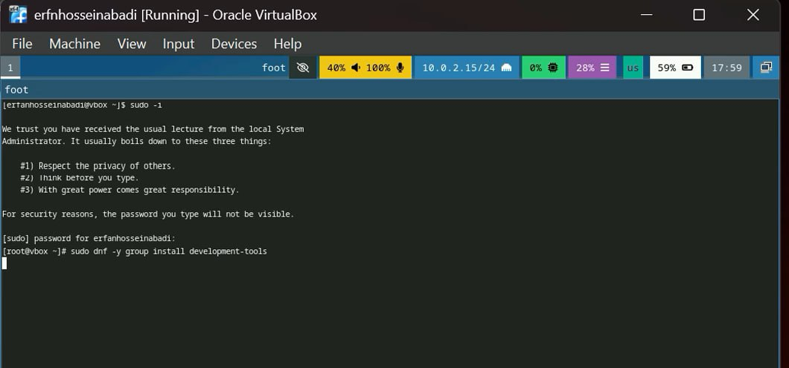
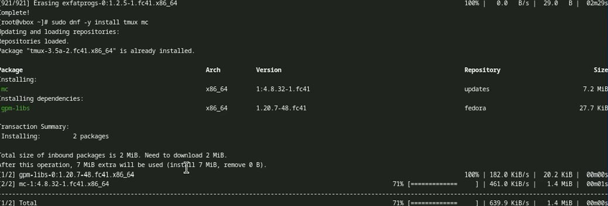
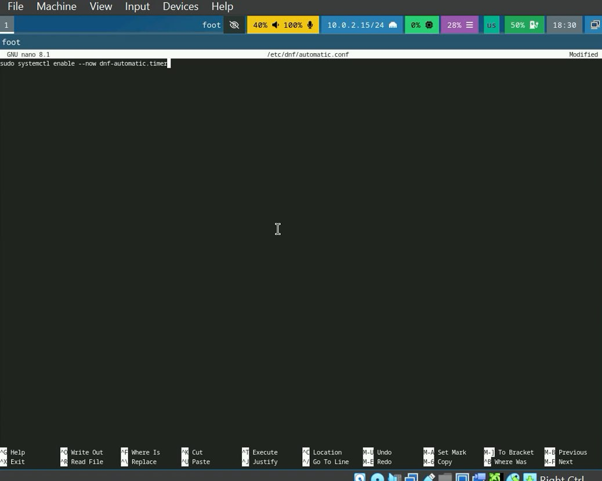
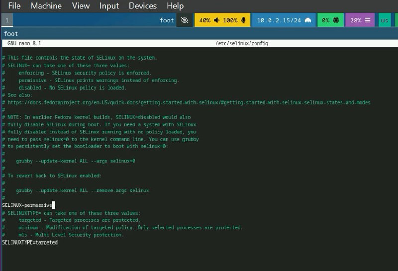
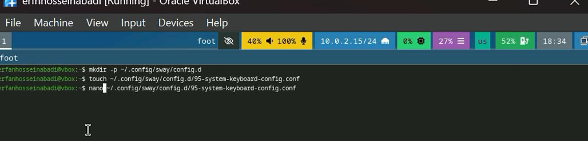
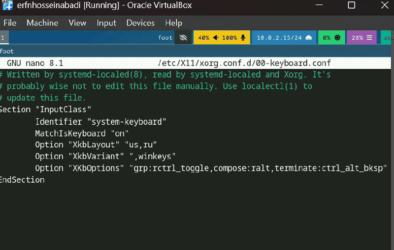
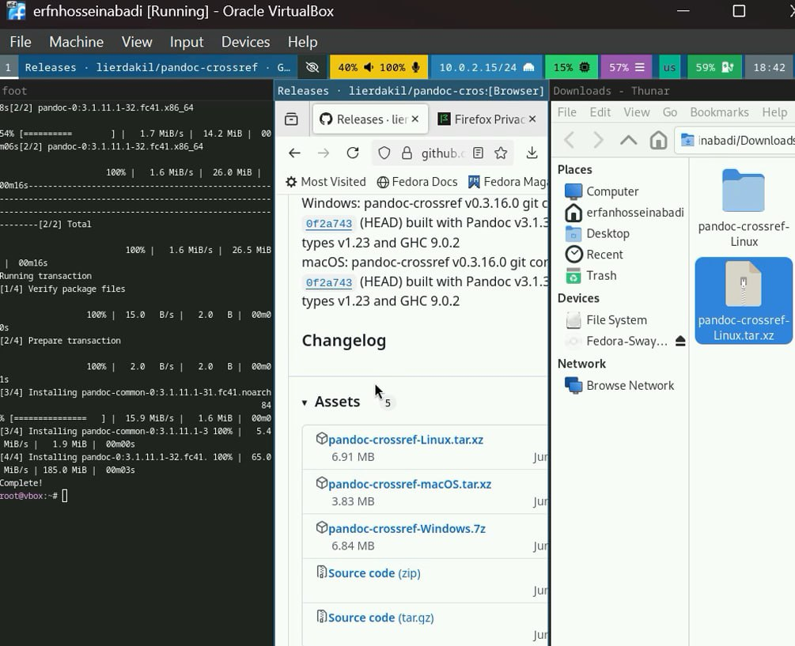
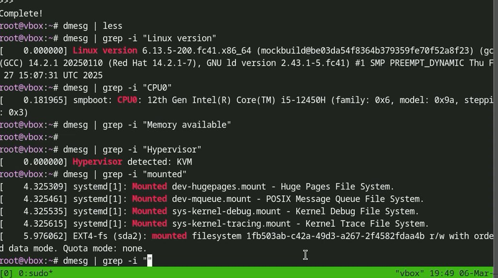

---
## Front matter
title: "Отчёт по лабораторной работе №1"
subtitle: "Специальность: архитектура компьютеров"
author: "Ерфан Хосейнабади"

## Generic otions
lang: ru-RU
toc-title: "Содержание"

## Bibliography
bibliography: bib/cite.bib
csl: pandoc/csl/gost-r-7-0-5-2008-numeric.csl

## Pdf output format
toc: true # Table of contents
toc-depth: 2
lof: true # List of figures
lot: true # List of tables
fontsize: 12pt
linestretch: 1.5
papersize: a4
documentclass: scrreprt
## I18n polyglossia
polyglossia-lang:
  name: russian
  options:
	- spelling=modern
	- babelshorthands=true
polyglossia-otherlangs:
  name: english
## I18n babel
babel-lang: russian
babel-otherlangs: english
## Fonts
mainfont: IBM Plex Serif
romanfont: IBM Plex Serif
sansfont: IBM Plex Sans
monofont: IBM Plex Mono
mathfont: STIX Two Math
mainfontoptions: Ligatures=Common,Ligatures=TeX,Scale=0.94
romanfontoptions: Ligatures=Common,Ligatures=TeX,Scale=0.94
sansfontoptions: Ligatures=Common,Ligatures=TeX,Scale=MatchLowercase,Scale=0.94
monofontoptions: Scale=MatchLowercase,Scale=0.94,FakeStretch=0.9
mathfontoptions:
## Biblatex
biblatex: true
biblio-style: "gost-numeric"
biblatexoptions:
  - parentracker=true
  - backend=biber
  - hyperref=auto
  - language=auto
  - autolang=other*
  - citestyle=gost-numeric
## Pandoc-crossref LaTeX customization
figureTitle: "Рис."
tableTitle: "Таблица"
listingTitle: "Листинг"
lofTitle: "Список иллюстраций"
lotTitle: "Список таблиц"
lolTitle: "Листинги"
## Misc options
indent: true
header-includes:
  - \usepackage{indentfirst}
  - \usepackage{float} # keep figures where there are in the text
  - \floatplacement{figure}{H} # keep figures where there are in the text
---

# Цель работы

Целью данной работы является приобретение практических навыков установки операционной системы на виртуальную машину, настройки минимально необходимых для дальнейшей работы сервисов.

# Задание

1) Запуск VirtualBox и создание новой виртуальной машины (операционная система Linux, Fedora). 
2) Настройка установки ОС. 
3)Перезапуск виртуальной машины и установка драйверов для VirtualBox. 
4)Подключение образа диска дополнений гостевой ОС. 
5)Установка необходимого ПО для создания документации. 
6)Выполнение домашнего задания.

# Теоретическое введение

Операционная система - это комплекс взаимосвязанных программ, который действует как интерфейс между приложениями и пользователями с одной стороны и аппаратурой компьютера с другой стороны. VirtualBox - это специальное средство для виртуализации, позволяющее запускать операционную систему внутри другой. С помощью VirtualBox мы можем также настраивать сеть, обмениваться файлами и делать многое другое

## Выполнение лабораторной работы

## Загрузка Fedora Sway

Я скачал Fedora Sway и теперь использую свою учетную запись и пароль для входа. (Fig. -@fig:001)

{#fig:001 width=70%}

## Установка необходимых инструментов для разработки.

Я скачал все инструменты для разработки и обновил все пакеты. (Fig. -@fig:002)

{#fig:002 width=70%}

## Повышение комфорта работы

Скачиваю tmux и mc для более удобной работы в консоли (Fig. -@fig:003)

{#fig:003 width=70%}

## Автоматическое обновление

Я изменил конфигурацию для автоматического обновления (Fig. -@fig:004)

{#fig:004 width=70%}

## Отключение SELinux

Я изменил значение в SELinux, чтобы он был отключен (Fig. -@fig:005)

{#fig:005 width=70%}

## Настройка раскладки клавиатуры

1. Я создал необходимый файл для раскладки клавиатуры (Fig. -@fig:006)

   {#fig:006 width=70%}

2. Я редактирую следующий конфигурационный файл и Reboot (Fig. -@fig:007)

   {#fig:007 width=70%}

## Установка программного обеспечения для создания документации

Я скачал pandoc, pandoc-crossref и texlive для работы с markdown-файлами (Fig. -@fig:008)

{#fig:008 width=70%}

# Домашнее задание

Использую dmesg, чтобы получить нужную мне информацию (Fig. -@fig:009)

{#fig:009 width=70%}

# Контрольные вопросы

1) Какую информацию содержит учетная запись пользователя? 
Имя пользователя, зашифрованный пароль пользователя, индентификационный номер пользователя, индентификационный номер группы пользователя, домашний каталог пользователя, командный интерпретатор пользователя.

2) Укажите команды терминала и приведите примеры: -для получения справки по команде: man man cd -ддя перемещения по файловой системе: cd cd ~/Downloads - для просмотра содержимого каталога: ls ls ~ Downloads - для определения объема каталога: du du Downloads -для создания каталогов: mkdir mkdir ~ Downloads/New - для создания файлов: touch touch retouch - для удаления каталогов: rm rm dir1 - для удаления файлов: rm -r rm -r text.txt - для задания определенных прав на файл или каталог: chmod + x chmod +x text.txt -для просмотра истории команд: history

3) Что такое файловая система? Приведите примеры с краткой характеристикой.
Файловая система - это часть операционной системы, назначение которой состоит в том, чтобы обеспечить пользователю удобный интерфейс при работе с данными, хранящимися на диске, и обеспечить совместное использование файлов несколькими пользователями и процессорами. Примеры файловых систем: Ext2, Ext3, Ext4 или Extended Felisystem - стандартная файловая система для Linux. NTFS (New Technology File System): Стандартная файловая система для Windows.

4) Как посмотреть, какие файловые системы подмонтированы в ОС?
Команда mount

5) Как удалить зависший процесс?
Команда kill

# Выводы

В результате выполнения лабораторной работы мы приобрели навыки установки операционной системы на виртуальную машину, а также настройки минимально необходимых для дальнейшей работы сервисов.

# Контрольные вопросы

1) Какую информацию содержит учетная запись пользователя? 
Имя пользователя, зашифрованный пароль пользователя, индентификационный номер пользователя, индентификационный номер группы пользователя, домашний каталог пользователя, командный интерпретатор пользователя.

2) Укажите команды терминала и приведите примеры: -для получения справки по команде: man man cd -ддя перемещения по файловой системе: cd cd ~/Downloads - для просмотра содержимого каталога: ls ls ~ Downloads - для определения объема каталога: du du Downloads -для создания каталогов: mkdir mkdir ~ Downloads/New - для создания файлов: touch touch retouch - для удаления каталогов: rm rm dir1 - для удаления файлов: rm -r rm -r text.txt - для задания определенных прав на файл или каталог: chmod + x chmod +x text.txt -для просмотра истории команд: history

3) Что такое файловая система? Приведите примеры с краткой характеристикой.
Файловая система - это часть операционной системы, назначение которой состоит в том, чтобы обеспечить пользователю удобный интерфейс при работе с данными, хранящимися на диске, и обеспечить совместное использование файлов несколькими пользователями и процессорами. Примеры файловых систем: Ext2, Ext3, Ext4 или Extended Felisystem - стандартная файловая система для Linux. NTFS (New Technology File System): Стандартная файловая система для Windows.

4) Как посмотреть, какие файловые системы подмонтированы в ОС?
Команда mount

5) Как удалить зависший процесс?
Команда kill

# Выводы

В результате выполнения лабораторной работы мы приобрели навыки установки операционной системы на виртуальную машину, а также настройки минимально необходимых для дальнейшей работы сервисов.

# Список литературы{.unnumbered}

::: {#refs}
:::