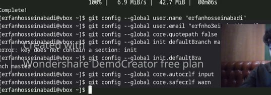
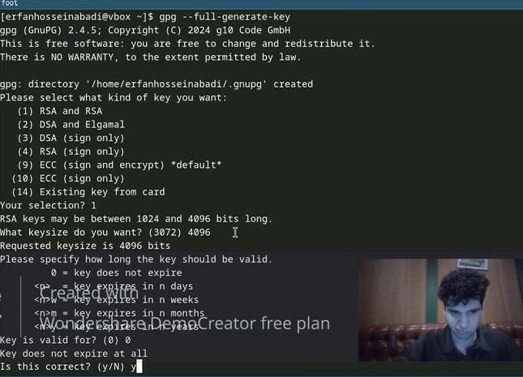
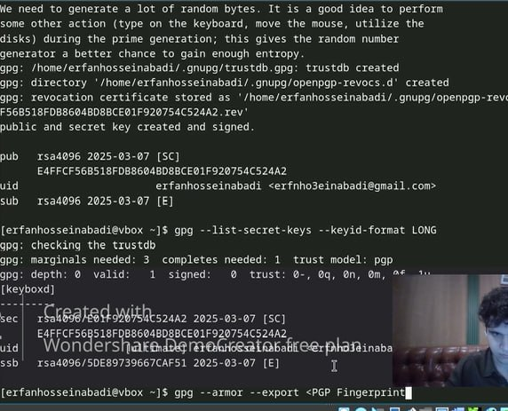
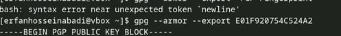
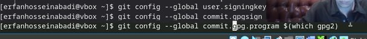
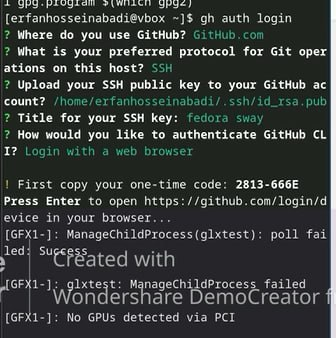
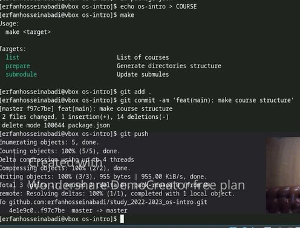

---
## Front matter
title: "Отчёт по лабораторной работе №2"
subtitle: "Специальность: архитектура компьютеров"
author: "Ерфан Хосейнабади"

## Generic otions
lang: ru-RU
toc-title: "Содержание"

## Bibliography
bibliography: bib/cite.bib
csl: pandoc/csl/gost-r-7-0-5-2008-numeric.csl

## Pdf output format
toc: true # Table of contents
toc-depth: 2
lof: true # List of figures
lot: true # List of tables
fontsize: 12pt
linestretch: 1.5
papersize: a4
documentclass: scrreprt
## I18n polyglossia
polyglossia-lang:
  name: russian
  options:
	- spelling=modern
	- babelshorthands=true
polyglossia-otherlangs:
  name: english
## I18n babel
babel-lang: russian
babel-otherlangs: english
## Fonts
mainfont: IBM Plex Serif
romanfont: IBM Plex Serif
sansfont: IBM Plex Sans
monofont: IBM Plex Mono
mathfont: STIX Two Math
mainfontoptions: Ligatures=Common,Ligatures=TeX,Scale=0.94
romanfontoptions: Ligatures=Common,Ligatures=TeX,Scale=0.94
sansfontoptions: Ligatures=Common,Ligatures=TeX,Scale=MatchLowercase,Scale=0.94
monofontoptions: Scale=MatchLowercase,Scale=0.94,FakeStretch=0.9
mathfontoptions:
## Biblatex
biblatex: true
biblio-style: "gost-numeric"
biblatexoptions:
  - parentracker=true
  - backend=biber
  - hyperref=auto
  - language=auto
  - autolang=other*
  - citestyle=gost-numeric
## Pandoc-crossref LaTeX customization
figureTitle: "Рис."
tableTitle: "Таблица"
listingTitle: "Листинг"
lofTitle: "Список иллюстраций"
lotTitle: "Список таблиц"
lolTitle: "Листинги"
## Misc options
indent: true
header-includes:
  - \usepackage{indentfirst}
  - \usepackage{float} # keep figures where there are in the text
  - \floatplacement{figure}{H} # keep figures where there are in the text
---
# Цель работы
  
- Изучить идеологию и применение средств контроля версий. 
- Освоить умения по работе с git.

# Задание 

1. Создать базовую конфигурацию для работы с git. 
2. Создать ключ SSH. 
3. Создать ключ PGP. 
4. Настроить подписи git. 
5. Зарегистрироваться на Github. 
6. Создать локальный каталог для выполнения заданий по предмету. 


# Теоретические сведения  

Системы контроля версий (Version Control System, VCS) применяются при 
работе нескольких человек над одним проектом. Обычно основное дерево 
проекта хранится в локальном или удалённом репозитории, к которому настроен 
доступ для участников проекта. При внесении изменений в содержание проекта 
система контроля версий позволяет их фиксировать, совмещать изменения, 
произведённые разными участниками проекта, производить откат к любой более 
ранней версии проекта, если это требуется. 
В классических системах контроля версий используется централизованная 
модель, предполагающая наличие единого репозитория для хранения файлов. 
Выполнение большинства функций по управлению версиями осуществляется 
специальным сервером. Участник проекта (пользователь) перед началом работы 
посредством определённых команд получает нужную ему версию файлов. После 
внесения изменений, пользователь размещает новую версию в хранилище. При 
этом предыдущие версии не удаляются из центрального хранилища и к ним 
можно вернуться в любой момент. Сервер может сохранять не полную версию 
изменённых файлов, а производить так называемую дельта-компрессию — 
сохранять только изменения между последовательными версиями, что позволяет 
уменьшить объём хранимых данных. 
Системы контроля версий поддерживают возможность отслеживания и 
разрешения конфликтов, которые могут возникнуть при работе нескольких 
человек над одним файлом. Можно объединить (слить) изменения, сделанные 
разными участниками (автоматически или вручную), вручную выбрать нужную 
версию, отменить изменения вовсе или заблокировать файлы для изменения. В 
зависимости от настроек блокировка не позволяет другим пользователям 
получить рабочую копию или препятствует изменению рабочей копии файла 
средствами 
файловой системы ОС, обеспечивая таким образом, 
привилегированный доступ только одному пользователю, работающему с 
файлом. 
Системы контроля версий также могут обеспечивать дополнительные, более 
гибкие функциональные возможности. Например, они могут поддерживать 
работу с несколькими версиями одного файла, сохраняя общую историю 
изменений до точки ветвления версий и собственные истории изменений каждой 
ветви. Кроме того, обычно доступна информация о том, кто из участников, когда 
и какие изменения вносил. Обычно такого рода информация хранится в журнале 
изменений, доступ к которому можно ограничить. 
В отличие от классических, в распределённых системах контроля версий 
центральный репозиторий не является обязательным. 
Среди классических VCS наиболее известны CVS, Subversion, а среди 
распределённых — Git, Bazaar, Mercurial. Принципы их работы схожи, 
отличаются они в основном синтаксисом используемых в работе команд

# Задание для самостоятельной работы 

## 1. Создание базовой конфигурации для работы с **Git**

Для начала необходимо выполнить базовую настройку **Git**, задав имя и email владельца репозитория. Используйте следующие команды:

```bash
git config --global user.name "Ваше Имя"
git config --global user.email "ваш_email@example.com"
```

{#fig:001 width:70%}

## 2. Создание ключа **SSH**

Следующим шагом является создание ключа **SSH** по алгоритму RSA с размером ключа **4096** бит. Введите команду:

```bash
ssh-keygen -t rsa -b 4096 -C "ваш_email@example.com"
```

При выполнении этой команды будет предложено указать место для сохранения ключа. Нажмите `Enter`, чтобы использовать значение по умолчанию.

{#fig:002 width:70%}

После этого вы можете скопировать сгенерированный SSH ключ из файла и вставить его в **GitHub** в разделе настроек SSH.

{#fig:003 width:70%}

## 3. Создание ключа PGP

Для создания ключа PGP выполните команду:

```bash
gpg --full-generate-key
```

Выберите параметры, указанные на изображениях, и завершите процесс генерации ключа.

{#fig:004 width:70%}
{#fig:005 width:70%}

Чтобы скопировать ваш сгенерированный PGP ключ в буфер обмена, используйте:

```bash
gpg --armor --export ваш_email@example.com
```

{#fig:006 width:70%}

## 4. Настройка подписей **Git**

Для настройки автоматической подписи коммитов используйте следующие команды:

```bash
git config --global commit.gpgSign true
git config --global user.signingkey ваш_PGP_ключ
```

Эти команды позволят **Git** использовать указанный PGP ключ для подписи коммитов.

{#fig:007 width:70%}
{#fig:008 width:70%}

## 5. Регистрация на **GitHub**

Необходимо авторизоваться на **GitHub**. Перейдите на сайт и выполните вход в свой аккаунт.

{#fig:009 width:70%}

## 6. Создание локального каталога для выполнения заданий

Создайте локальный каталог для хранения ваших заданий по предмету:

```bash
mkdir название_каталога
cd название_каталога
```

Мы создали каталог для нашего курса.

{#fig:010 width:70%}

## Использование репозитория

После создания каталога вы можете использовать репозиторий **yamadharma**:

{#fig:011 width:70%}

### Удаление лишних файлов

Удалите ненужные файлы с помощью команды:

```bash
rm ненужный_файл
```

{#fig:012 width:70%}

### Создание необходимых каталогов

Создайте все необходимые подкаталоги для организации вашего проекта:

```bash
mkdir подкаталог1 подкаталог2
```

{#fig:013 width:70%}

## Выводы

В результате выполнения задания вы:

- Настроили **Git** с вашим именем и email.
- Сгенерировали и добавили SSH ключ на **GitHub**.
- Создали PGP ключ и настроили автоматическую подпись коммитов.
- Зарегистрировались на **GitHub** и создали локальный каталог для работы.

Эти шаги являются основными для успешной работы с **Git** и **GitHub**.  

В этой лаборатории с помощью команд мы создаем новый репозиторий. Мы 
также смогли создать новый каталог с информацией о новом курсе. 
Как связать нашу учетную запись Github, чтобы мы могли работать, а также как 
сохранять, а затем загружать документы. 

# Ответы на контрольные вопросы. 

1. Что такое системы контроля версий (VCS) и для решения каких задач они 
предназначаются? 
Системы контроля версий (VCS) — это инструменты, которые позволяют 
управлять изменениями в коде, документах или других файлах в проекте. Они 
решают следующие задачи: 
2. Отслеживание изменений файлов. 
3. Хранение истории изменений. 
4. Совместная работа над проектом. 
5. Возможность отката к предыдущим версиям. 
6. Разрешение конфликтов при одновременном редактировании. 
7. Объясните следующие понятия VCS и их отношения: хранилище, commit, 
история, рабочая копия. 
8. Что представляют собой и чем отличаются централизованные и 
децентрализованные VCS? Приведите примеры VCS каждого вида. 
9. Опишите действия с VCS при единоличной работе с хранилищем. 
10. Опишите порядок работы с общим хранилищем VCS. 
11. Каковы основные задачи, решаемые инструментальным средством git? 
12. Назовите и дайте краткую характеристику командам git. 
13. Приведите примеры использования при работе с локальным и удалённым 
репозиториями. 
14. Что такое и зачем могут быть нужны ветви (branches)? 
15. Как и зачем можно игнорировать некоторые файлы при commit?
