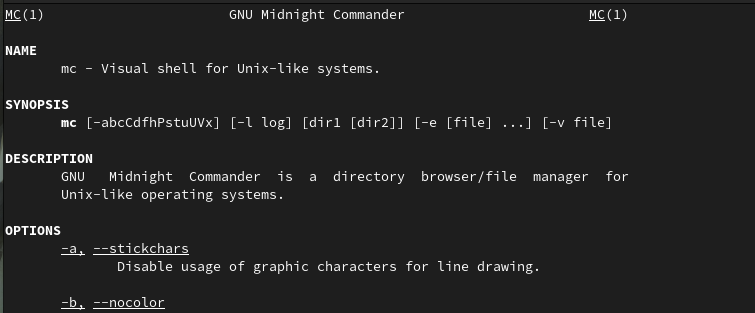
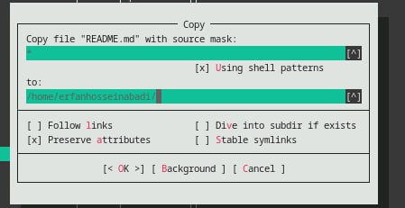
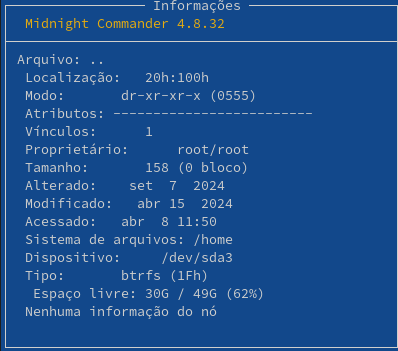
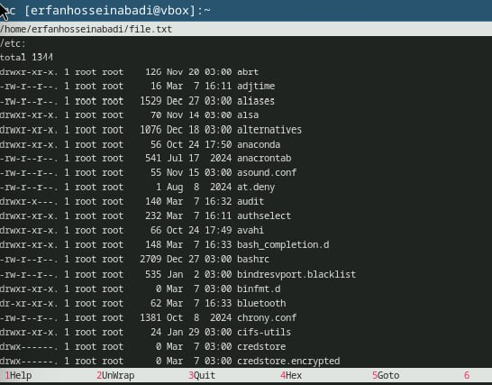
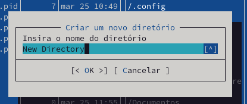
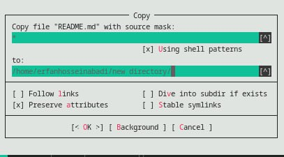
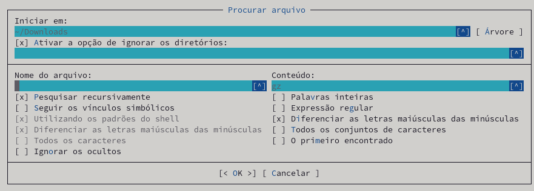
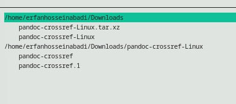
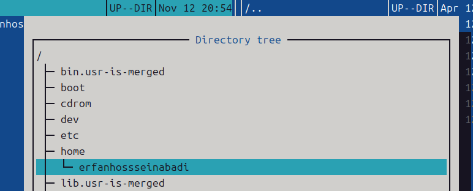
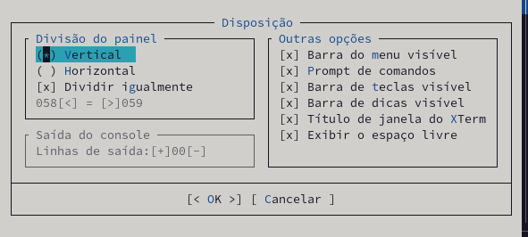

---
## Front matter
title: "Отчёта по лабораторной работе 9"
subtitle: "Операционные системы"
author: "Ерфан Хосейнабади"

## Generic otions
lang: ru-RU
toc-title: "Содержание"

## Bibliography
bibliography: bib/cite.bib
csl: pandoc/csl/gost-r-7-0-5-2008-numeric.csl

## Pdf output format
toc: true # Table of contents
toc-depth: 2
lof: true # List of figures
lot: true # List of tables
fontsize: 12pt
linestretch: 1.5
papersize: a4
documentclass: scrreprt
## I18n polyglossia
polyglossia-lang:
  name: russian
  options:
	- spelling=modern
	- babelshorthands=true
polyglossia-otherlangs:
  name: english
## I18n babel
babel-lang: russian
babel-otherlangs: english
## Fonts
mainfont: IBM Plex Serif
romanfont: IBM Plex Serif
sansfont: IBM Plex Sans
monofont: IBM Plex Mono
mathfont: STIX Two Math
mainfontoptions: Ligatures=Common,Ligatures=TeX,Scale=0.94
romanfontoptions: Ligatures=Common,Ligatures=TeX,Scale=0.94
sansfontoptions: Ligatures=Common,Ligatures=TeX,Scale=MatchLowercase,Scale=0.94
monofontoptions: Scale=MatchLowercase,Scale=0.94,FakeStretch=0.9
mathfontoptions:
## Biblatex
biblatex: true
biblio-style: "gost-numeric"
biblatexoptions:
  - parentracker=true
  - backend=biber
  - hyperref=auto
  - language=auto
  - autolang=other*
  - citestyle=gost-numeric
## Pandoc-crossref LaTeX customization
figureTitle: "Рис."
tableTitle: "Таблица"
listingTitle: "Листинг"
lofTitle: "Список иллюстраций"
lotTitle: "Список таблиц"
lolTitle: "Листинги"
## Misc options
indent: true
header-includes:
  - \usepackage{indentfirst}
  - \usepackage{float} # keep figures where there are in the text
  - \floatplacement{figure}{H} # keep figures where there are in the text
---

# Цель работы

Освоение основных возможностей командной оболочки Midnight Commander. Приобретение навыков практической работы по просмотру каталогов и файлов; манипуляций с ними.

# Задание

1. Задание по mc
2. Задание по встроенному редактору mc

# Выполнение лабораторной работы

Вызвав в коммандной строке man mc, я прочитала информацию о mc:

{#fig:001 width=70%}

Я запускала mc, изучала его структуру и меню:

{#fig:002 width=70%}

Используя управляющие клавиши я; скопировала файл README.md в домашний каталог:

{#fig:003 width=70%}

Создала файл new в ~/work/blog и удалила его: 

{#fig:004 width=70%}

{#fig:005 width=70%}

Получила информацию о размере и правах доступа на файл README.md:

{#fig:006 width=70%}

В правой панели вывела информацию о файле. При этом я получаю больше информации чем в выводе ls:

{#fig:007 width=70%}

Используя возможности подменю Файл; я посмотрела содержаемые текстового файла:

{#fig:008 width=70%}

редактировала содержаемые текстового файла (abrt на mi): 

{#fig:009 width=70%}

Создала новый каталог:

{#fig:0010 width=70%}

и скопировала файл в ,только что созданный каталог:

{#fig:0011 width=70%}

С помощью подменю команда можно найти в файловой системе файл с заданными условиями:

{#fig:0012 width=70%}

{#fig:0013 width=70%}

Исользуя подменю команда я повторила одну из предыдущих команд:

{#fig:0014 width=70%}

Также перешла в домашний каталог и анализировала файл меню и файл расширения:

{#fig:0015 width=70%}

{#fig:0016 width=70%}

Из подменю настройка вызвала окна настройки панели:

{#fig:0017 width=70%}

Настройки внешнего вида:

{#fig:0018 width=70%}

# Задание по встроенному редактору mc

С помощью команды touch создала text.txt:

{#fig:0019 width=70%}

Далее открыла его для редактирования с помощью f4 и с shift ctrl ins вставила текст:

{#fig:0020 width=70%}

С помощью f3 выделила текст и удалила выделеные слова f8:

{#fig:0021 width=70%}

Перемещала выделенный текст с помощью f6:

{#fig:0022 width=70%}

Сохранила изменении с помощью f2:

{#fig:0023 width=70%}

С помощью ctrl-u отменила последнее действие:

{#fig:0024 width=70%}

Используя pg up и pg dn перешла в начало и конец файла и написала некоторый текст. Затем сохранила и закрыла файл:

{#fig:0025 width=70%}

Открыла файл с исходным текстом на cpp:

{#fig:0026 width=70%}

Используя подменю команда я выключила подсветку синтаксиса:

{#fig:0027 width=70%}

# Выводы

При выполнении данной работы я освоила основные возможности командной оболочки Midnight Commander, приобретела навыки практической работы по просмотру каталогов и файлов; манипуляций с ними.

# Ответы на контрольные вопросы

1. Панели могут дополнительно быть переведены в один из двух режимов: Информация или Дерево. В режиме Информация на панель выводятся сведения о файле и текущей файловой системе, расположенных на активной панели. В режиме Дерево на одной из панелей выводится структура дерева каталогов.

2. В разделе Командная строка оболочки (Shell) перечисляются команды и комбинации клавиш, которые используются для ввода и редактирования команд в командной строке оболочки. Большая часть этих команд служит для переноса имен файлов и/или имен каталогов в командную строку (чтобы уменьшить трудоемкость ввода) или для доступа к истории команд. Клавиши редактирования строк ввода используются как при редактировании командной строки, так и других строк ввода, появляющихся в различных запросах программы.
Как с помощью меню так и с помощью команд shell можно переносить, копировать и получать информацию о файоах и каталогах.

3. В меню каждой (левой или правой) панели можно выбрать Формат списка:

стандартный — выводит список файлов и каталогов с указанием размера и времени правки;
ускоренный — позволяет задать число столбцов, на которые разбивается панель при выводе списка имён файлов или каталогов без дополнительной информации;
расширенный — помимо названия файла или каталога выводит сведения о правах доступа, владельце, группе, размере, времени правки;
определённый пользователем — позволяет вывести те сведения о файле или каталоге, которые задаст сам пользователь.

4. В меню Файл содержит перечень команд, которые могут быть применены к одному или нескольким файлам или каталогам.
Команды меню Файл:

Просмотр ( F3 ) — позволяет посмотреть содержимое текущего (или выделенного) файла без возможности редактирования.
Просмотр вывода команды ( М + ! ) — функция запроса команды с параметрами (аргумент к текущему выбранному файлу).
Правка ( F4 ) — открывает текущий (или выделенный) файл для его редактирования.
Копирование ( F5 ) — осуществляет копирование одного или нескольких файлов или каталогов в указанное пользователем во всплывающем окне место.
Права доступа ( Ctrl-x c ) — позволяет указать (изменить) права доступа к одному или нескольким файлам или каталогам .
Жёсткая ссылка ( Ctrl-x l ) — позволяет создать жёсткую ссылку к текущему (или выделенному) файлу.
Символическая ссылка ( Ctrl-x s ) — позволяет создать символическую ссылку к текущему (или выделенному) файлу.
Владелец/группа ( Ctrl-x o ) — позволяет задать (изменить) владельца и имя группы для одного или нескольких файлов или каталогов.
Права (расширенные) — позволяет изменить права доступа и владения для одного или нескольких файлов или каталогов.
Переименование ( F6 ) — позволяет переименовать (или переместить) один или несколько файлов или каталогов.
Создание каталога ( F7 ) — позволяет создать каталог.
Удалить ( F8 ) — позволяет удалить один или несколько файлов или каталогов.
Выход ( F10 ) — завершает работу mc.

5. В меню Команда содержатся более общие команды для работы с mc. Команды меню Команда:

Дерево каталогов — отображает структуру каталогов системы.
Поиск файла — выполняет поиск файлов по заданным параметрам.
Переставить панели — меняет местами левую и правую панели.
Сравнить каталоги ( Ctrl-x d ) — сравнивает содержимое двух каталогов.
Размеры каталогов — отображает размер и время изменения каталога (по умолчанию в mc размер - каталога корректно не отображается).
История командной строки — выводит на экран список ранее выполненных в оболочке команд.
Каталоги быстрого доступа ( Ctrl-\ ) — пр вызове выполняется быстрая смена текущего каталога на один из заданного списка.
Восстановление файлов — позволяет восстановить файлы на файловых системах ext2 и ext3.
Редактировать файл расширений — позволяет задать с помощью определённого синтаксиса действия при запуске файлов с определённым расширением (например, какое программного обеспечение запускать для открытия или редактирования файлов с расширением doc или docx).
Редактировать файл меню — позволяет отредактировать контекстное меню пользователя, вызываемое по клавише F2 .
Редактировать файл расцветки имён — позволяет подобрать оптимальную для пользователя расцветку имён файлов в зависимости от их типа.

6. Меню Настройки содержит ряд дополнительных опций по внешнему виду и функциональности mc. Меню Настройки содержит:

Конфигурация — позволяет скорректировать настройки работы с панелями.
Внешний вид и Настройки панелей — определяет элементы (строка меню, командная строка, подсказки и прочее), отображаемые при вызове mc, а также геометрию расположения панелей и цветовыделение.
Биты символов — задаёт формат обработки информации локальным терминалом.
Подтверждение — позволяет установить или убрать вывод окна с запросом подтверждения действий при операциях удаления и перезаписи файлов, а также при выходе из программы.
Распознание клавиш — диалоговое окно используется для тестирования функциональных клавиш, клавиш управления курсором и прочее.
Виртуальные ФС –– настройки виртуальной файловой системы: тайм-аут, пароль и прочее.

7. F1 Вызов контекстно-зависимой подсказки;
F2 Вызов пользовательского меню с возможностью создания и/или дополнения дополнительных функций;
F3 Просмотр содержимого файла, на который указывает подсветка в активной панели (без возможности редактирования);
F4 Вызов встроенного в mc редактора для изменения содержания файла, на который указывает подсветка в активной панели;
F5 Копирование одного или нескольких файлов, отмеченных в первой (активной) панели, в каталог, отображаемый на второй панели;
F6 Перенос одного или нескольких файлов, отмеченных в первой (активной) панели, в каталог, отображаемый на второй панели;
F7 Создание подкаталога в каталоге, отображаемом в активной панели;
F8 Удаление одного или нескольких файлов (каталогов), отмеченных в первой (активной) панели файлов;
F9 Вызов меню mc;
F10 Выход из mc;

8. Ctrl-y удалить строку;
Ctrl-u отмена последней операции; Ins вставка/замена;
F7 поиск (можно использовать регулярные выражения);
(стрелочка вверх)-F7 повтор последней операции поиска;
F4 замена;
F3 первое нажатие — начало выделения,
второе — окончание выделения;
F5 копировать выделенный фрагмент;
F6 переместить выделенный фрагмент;
F8 удалить выделенный фрагмент;
F2 записать изменения в файл;
F10 выйти из редактора.

9. Можете сохранить часто используемые команды панелизации под отдельными информативными именами, чтобы иметь возможность их быстро вызвать по этим именам. Для этого нужно набрать команду в строке ввода (строка "Команда") и нажать кнопку Добавить. После этого потребуется ввести имя, по которому мы будем вызывать команду. В следующий раз вам достаточно будет выбрать нужное имя из списка, а не вводить всю команду заново.

10. Панель в mc отображает список файлов текущего каталога. Абсолютный путь к этому каталогу отображается в заголовке панели. У активной панели заголовок и одна из её строк подсвечиваются. Управление панелями осуществляется с помощью определённых комбинаций клавиш или пунктов меню mc.

# Список литературы{.unnumbered}

::: {#refs}
:::